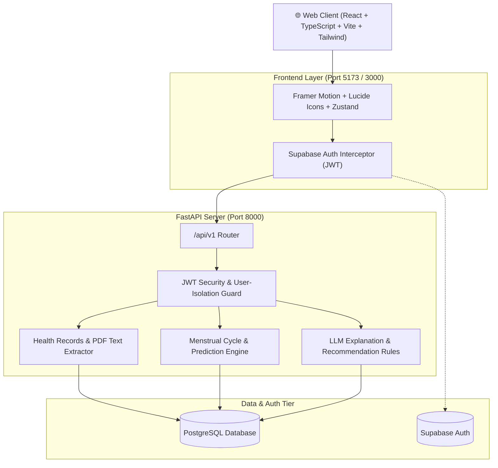

<div align="center">

# ✨ Checkd — AI-Powered Personal Health & Wellness Platform ✨

<p align="center">
  
  &nbsp;&nbsp;&nbsp;&nbsp;&nbsp;&nbsp;&nbsp;&nbsp;
  
</p>

### *Understand what your body is telling you.*

[](https://fastapi.tiangolo.com)
[](https://reactjs.org/)
[](https://www.typescriptlang.org/)
[](https://tailwindcss.com/)
[](https://supabase.com)
[](https://www.postgresql.org/)

<p align="center">
  <a href="#-core-features"><strong>Explore Features</strong></a> •
  <a href="#-quickstart-guide"><strong>Quickstart Guide</strong></a> •
  <a href="#-system-architecture"><strong>Architecture</strong></a> •
  <a href="#-project-structure"><strong>Structure</strong></a> •
  <a href="#-verification--tests"><strong>Testing</strong></a>
</p>

---

</div>

## 🌟 What is Checkd?

**Checkd** is a privacy-first, full-stack health intelligence platform designed to translate complex medical data, laboratory reports, and daily wellness telemetry into actionable, plain-language insights.

Whether parsing blood test PDFs, logging daily vital signs, or tracking menstrual cycles, Checkd organizes your health records securely under authenticated user isolation.

---

## 🎨 Meet Your Checkd Companions

<table>
  <tr>
    <td align="center" width="33%">
      <br />
      <strong>Mia</strong><br />
      <em>Guiding your daily check-ins & health habits</em>
    </td>
    <td align="center" width="33%">
      <br />
      <strong>Arjun</strong><br />
      <em>Breaking down complex lab reports & metrics</em>
    </td>
    <td align="center" width="33%">
      <br />
      <strong>Wellness Flow</strong><br />
      <em>Building long-term lifestyle recommendations</em>
    </td>
  </tr>
</table>

---

## 🚀 Core Features

### 1. 📋 Automated Lab Report & PDF Parsing
- Upload PDF blood tests and clinical lab panels up to 10 MB.
- Server-side text extraction automatically parses structured metrics (HbA1c, Fasting Glucose, Lipid Panel, Hemoglobin, etc.) and compares them against physiological reference ranges.

### 2. ⚡ Daily Wellness Vitals & Streak Tracking
- Record daily subjective vitals: Energy, Mood, Stress levels, Sleep duration, and Water intake.
- Verified active streak counter and weekly Mon–Sun visual completion grid derived from real database timestamps.

### 3. 🌸 Cycle & Period Tracking
- Privacy-scoped menstrual cycle and period logs for female user profiles.
- Automatic baseline predictions (start/end window, cycle day, average duration) computed dynamically from historical logs.
- Interactive monthly calendar and customizable reminder preferences.

### 4. 🧠 Educational AI Explanations & Actionable Recommendations
- Plain-language educational summaries explaining what extracted metrics indicate.
- Actionable next steps categorized by priority (`high`, `medium`, `low`) with interactive status management (`Complete`, `Dismiss`, `Undo`).

### 5. 👤 Personalized Health Profile
- Custom profile avatar upload with live preview and multi-session persistence.
- Real profile completeness progress gauge calculated from stored health background fields.

---

## 🏗️ System Architecture



---

## ⚡ Quickstart Guide

Follow these steps to clone and run the Checkd platform locally on your machine.

### Prerequisites

- **Node.js** 18.x or higher ([Download Node.js](https://nodejs.org/))
- **Python** 3.11 or higher ([Download Python](https://www.python.org/))
- **Git** ([Download Git](https://git-scm.com/))
- *(Optional)* Supabase account for cloud auth & storage

---

### Step 1: Clone the Repository

```bash
git clone https://github.com/drashti777oo/Checkd.git
cd Checkd
```

---

### Step 2: Backend Setup (FastAPI)

1. Open a terminal and navigate to the `backend` folder:
   ```bash
   cd backend
   ```

2. Create and activate a Python virtual environment:
   - **Windows (PowerShell):**
     ```powershell
     python -m venv venv
     .\venv\Scripts\Activate.ps1
     ```
   - **macOS / Linux:**
     ```bash
     python3 -m venv venv
     source venv/bin/activate
     ```

3. Install required Python packages:
   ```bash
   pip install -r requirements.txt
   ```

4. Create your local environment configuration:
   ```bash
   cp .env.example .env
   ```

5. Start the FastAPI development server:
   ```bash
   uvicorn app.main:app --reload --port 8000
   ```
   > 📖 **API Docs:** Open [http://localhost:8000/docs](http://localhost:8000/docs) in your browser to view the interactive Swagger API documentation.

---

### Step 3: Frontend Setup (React + Vite)

1. Open a **new terminal** window and navigate to the `frontend` folder:
   ```bash
   cd frontend
   ```

2. Install dependencies:
   ```bash
   npm install
   ```

3. Configure environment variables:
   ```bash
   cp .env.example .env
   ```
   *(Ensure `VITE_API_BASE_URL=http://localhost:8000/api/v1` is set in `frontend/.env`)*

4. Start the frontend Vite development server:
   ```bash
   npm run dev
   ```

5. Open your browser at **[http://localhost:5173](http://localhost:5173)** (or the port displayed in your terminal).

---

## 🐳 Docker Deployment (Optional)

To run the entire Checkd stack using Docker Compose:

```bash
# In the root project directory:
cp .env.example .env
docker compose up --build
```

- **Frontend:** [http://localhost:3000](http://localhost:3000)
- **Backend API:** [http://localhost:8000](http://localhost:8000)
- **API Docs:** [http://localhost:8000/docs](http://localhost:8000/docs)

---

## 📁 Project Structure

```
Checkd/
├── backend/                  # FastAPI Application
│   ├── alembic/              # Database migration versions
│   ├── app/
│   │   ├── api/v1/           # API routes (health, cycle, checkin, profile, etc.)
│   │   ├── core/             # Config, database engine, JWT security
│   │   ├── models/           # SQLAlchemy 2.x declarative ORM models
│   │   ├── schemas/          # Pydantic v2 request/response schemas
│   │   ├── services/         # Business logic (cycle math, PDF parser, AI)
│   │   └── utils/            # PDF text extraction utilities
│   ├── tests/                # Automated pytest suite
│   ├── requirements.txt      # Python dependencies
│   └── pyproject.toml        # Pytest & lint configuration
│
├── frontend/                 # React 18 + Vite SPA
│   ├── public/
│   │   └── images/           # Character assets (Mia, Arjun, illustrations)
│   ├── src/
│   │   ├── components/       # Layout, Navbar, shared cards, modals
│   │   ├── pages/            # LandingPage, Dashboard, CycleTracker, History, Result, Profile
│   │   ├── services/         # Axios API clients (auth, health, cycle, checkin)
│   │   ├── types/            # TypeScript data contracts
│   │   ├── hooks/            # useAuth, useHealthData
│   │   └── store/            # Zustand state management
│   ├── package.json
│   └── vite.config.ts
│
├── docs/                     # System architecture & setup documentation
├── docker-compose.yml        # Multi-container local deployment
└── README.md                 # Project guide & quickstart
```

---

## 🧪 Verification & Tests

### Backend Automated Test Suite
To run the automated backend test suite:
```bash
cd backend
python -m pytest -v
```

### Frontend Production Build
To verify the TypeScript compile and production bundle:
```bash
cd frontend
npm run build
```

---

## 🔒 Privacy, Security & Disclaimers

> **Educational Disclaimer:** Checkd is developed for wellness tracking, health habit formation, and educational laboratory data organization. It does not provide medical diagnoses or clinical prescriptions. Always consult a certified healthcare professional for medical advice.

- **User Isolation:** All health records, cycle logs, and check-ins are strictly isolated by verified user JWT tokens.
- **No Mock / Invented Data:** Displayed metrics, cycle timelines, and streak calculations strictly reflect real user database records.

---

<div align="center">
  <p>Built with 💛 for modern health intelligence.</p>
</div>
